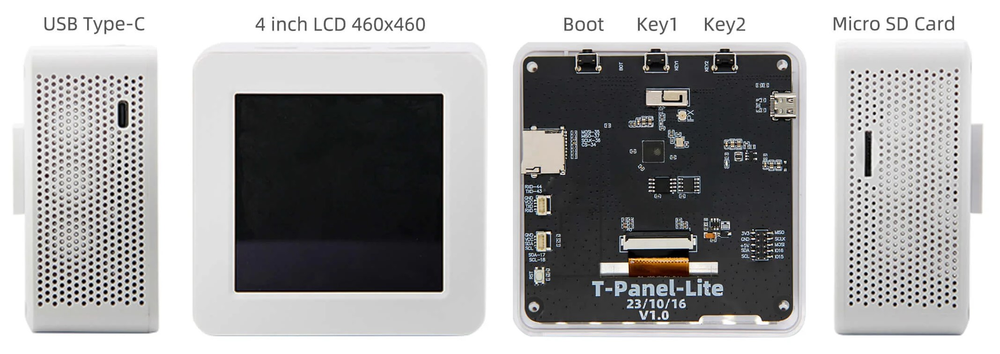
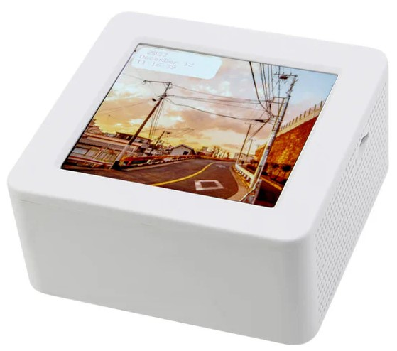
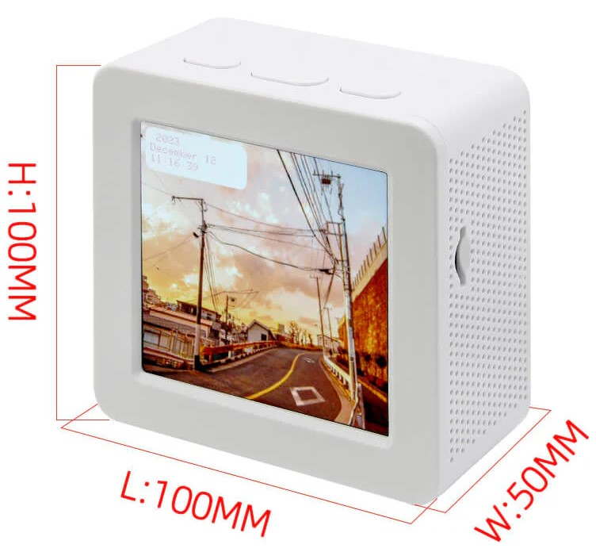

<h1 align="center">T-Panel-Lite</h1>

## **English** | [中文](./README_CN.md)

[](./LICENSE)
[](https://github.com/espressif/esp-idf)
[](https://isocpp.org/)

<p align="center">
  
</p>

## Overview

T-Panel-Lite is the simplified, non-touch version of T-Panel. It uses an
**ESP32-S3**, a **480 x 480 ST7701 RGB display**, a MicroSD slot, and three
physical buttons. This branch uses the same ESP-IDF project layout and coding
style as T-Panel, adapted for the Lite board's direct GPIO wiring.

> [!NOTE]
> T-Panel-Lite does **not** include the CST3240 touch panel, XL9535 GPIO
> expander, ESP32-H2, RS485, or CAN hardware found on other T-Panel variants.

## Directory

- [Overview](#overview)
- [Hardware Versions](#hardware-versions)
- [Preview](#preview)
- [Supported Frameworks](#supported-frameworks)
- [Quick Start](#quick-start)
- [Hardware Modules](#hardware-modules)
- [Pin Overview](#pin-overview)
- [Project Materials](#project-materials)
- [FAQ](#faq)

## Hardware Versions

| Version | Date | Description |
| :---: | :---: | --- |
| T-Panel-Lite V1.0 | 2023-11-23 | ESP32-S3, 16 MB flash, 8 MB PSRAM |

## Preview

<p align="center">
  
  
</p>

## Supported Frameworks

| Framework | Status | Version |
| --- | --- | --- |
| ESP-IDF | Recommended | `>= v5.5.4` |

## Quick Start

### Build With ESP-IDF

Install ESP-IDF first. For environment setup, refer to the official guide:
[ESP-IDF Get Started](https://docs.espressif.com/projects/esp-idf/en/latest/esp32s3/get-started/index.html)

```bash
idf.py set-target esp32s3
idf.py menuconfig
idf.py build
idf.py flash monitor
```

Select one of the following examples in `menuconfig`, then rebuild the project.

```text
Example Configuration
`-- Select the example to build
```

| Example | Description |
| --- | --- |
| [`screen`](./main/examples/screen) | Basic RGB LCD bring-up example |
| [`screen_lvgl`](./main/examples/screen_lvgl) | LVGL 9.5 display startup example |
| [`sd`](./main/examples/sd) | SD card mount and file-system test |
| [`general_test`](./main/examples/general_test) | Integrated factory test UI |

The following firmware is prebuilt.

To flash prebuilt firmware, refer to Espressif's official [ESP firmware online flashing platform guide](https://docs.espressif.com/projects/esp-techpedia/zh_CN/latest/esp-friends/get-started/try-firmware/try-firmware-platform.html).

| Firmware | Flash Address | Description |
| --- | --- | --- |
| [`general_test`](<./firmware/[t-panel-lite_v1.0][general_test]_firmware_202607171157.bin>) | `0x0` | T-Panel-Lite V1.0 `general_test` factory test firmware |

## Hardware Modules

### MCU

- ESP32-S3
- Flash: 16 MB
- PSRAM: 8 MB (Quad SPI)

### Display

- Model: YDP395BT001
- Size: 3.95 inches
- Resolution: 480 x 480
- Driver: ST7701S
- Interface: direct 9-bit SPI initialization plus 16-bit RGB data
- Touch: not fitted

### Storage and controls

- MicroSD over SPI
- KEY1, KEY2, and BOOT physical buttons

## Pin Overview

Definitions are centralized in
[`t_panel_config.h`](./libraries/private_library/t_panel_config.h).

## Project Materials

| Resource | Description |
| --- | --- |
| [`T-Panel_Lite_V1.0.pdf`](./project/T-Panel_Lite_V1.0.pdf) | Hardware project document |
| [`YDP395BT001-V2.pdf`](./docs/YDP395BT001-V2.pdf) | LCD module specification |
| [`ST7701S_SPEC_V1.4.pdf`](./docs/ST7701S_SPEC_V1.4.pdf) | ST7701S specification |

## FAQ

<details>
<summary>Q. Why does my board continuously fail to flash?</summary>

A. Please hold down the `BOOT` button and try downloading the program again.

</details>
